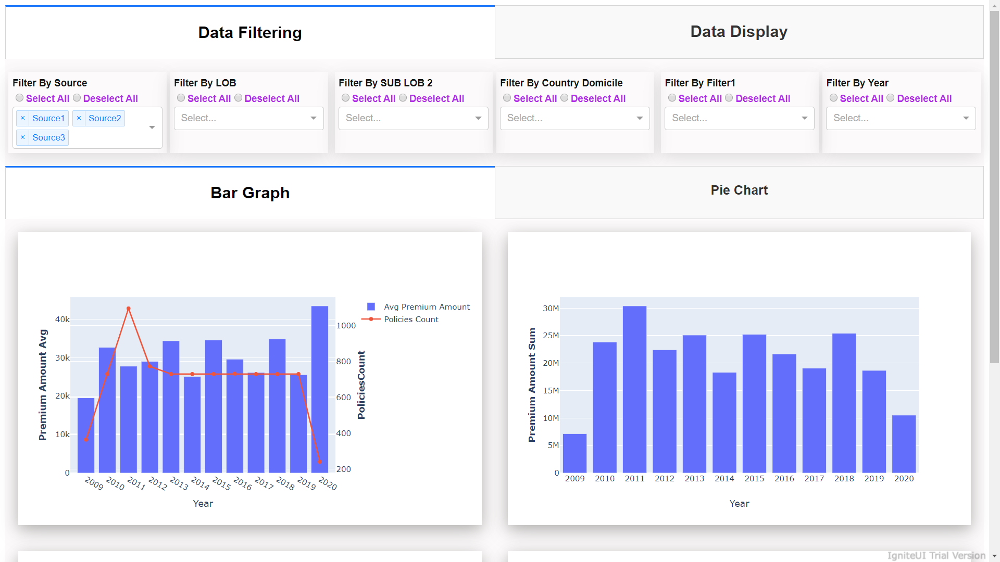
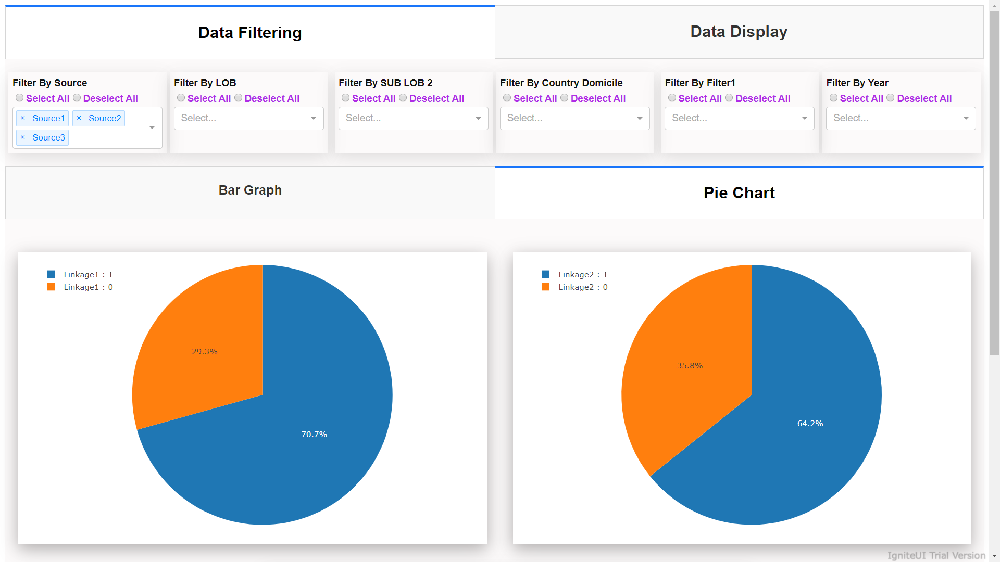
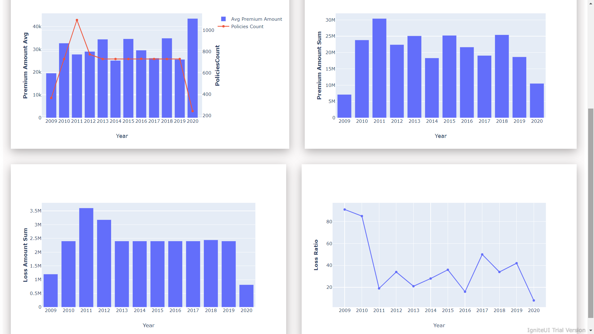
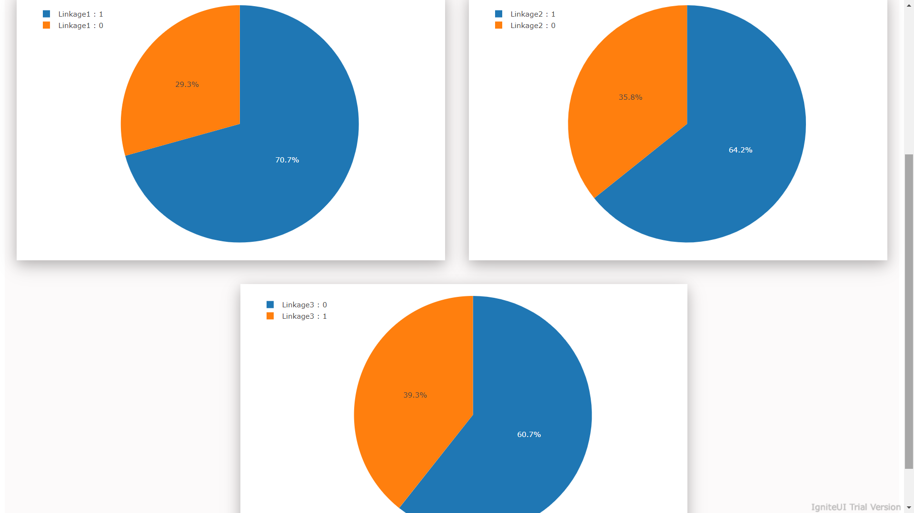

# Analytics-Dashboard-Using-Dash-And-Plotly
The aim of this project was to use dash and plotly library to build an analytics dashboard for the visualization of the data and getting different insights from it.

## Motivation
This project is a result of freelancing work that was offered to me to build a dashboard.

## Tech/framework used
- Dash
- Plotly
- Python 3.7
- Jupyter Notebook

## Features
This dashboard has the following features:
- It has filters that can applied to filter the data and visualize graph accordingly.
- There is a capability to see the raw data in an aggregated form.
- There are various different graphs for visualization.

## Screenshots
Please find the screenshot of the dashboard attached:
 

 

 

 

## License
MIT © [Kushal Agrawal]()
