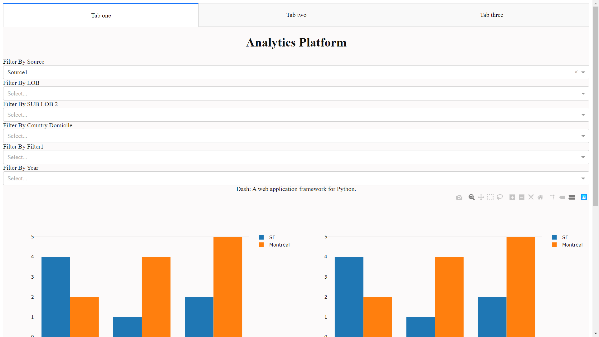
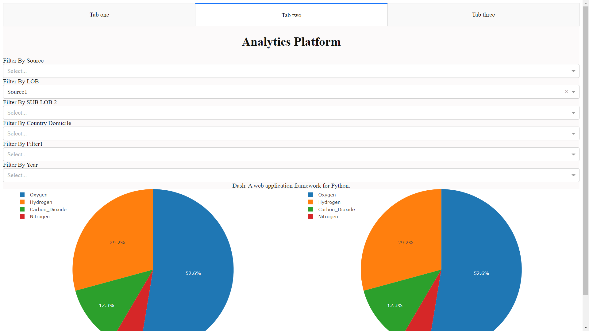
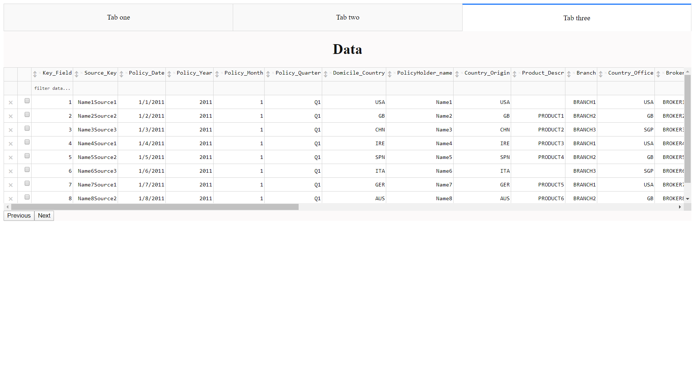

# Analytics-Dashboard-Using-Dash-And-Plotly
This project was developed to use the dash and plotly library to build an anlytics dashboard for the visualization of the data and getting different insights from it.

Please find the screenshot of the dashboard attached
 

